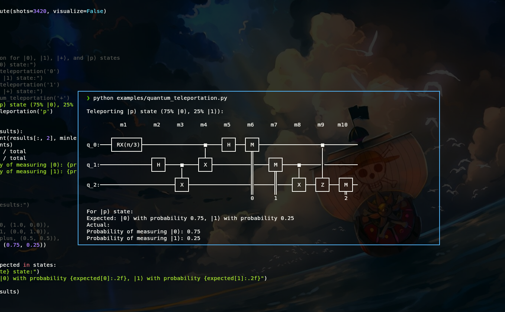

# QuasiQ

QuasiQ is a simple quantum computer simulator



Bell State Example

```python
from quasiq import Circuit


# simplest quantum entanglement
# both qbits are maximally entangled
# so you wil either get |00⟩ or |11⟩ (but not |01⟩ or |10⟩)
 
circuit = Circuit(2)
circuit.h(0)
circuit.cx(0, 1)
circuit.print_circuit()

results = circuit.execute(shots=10,visualize=True)

for result in results:
    print(result)

```
Output:
```rust
                   
        m1     m2  
                   
       ┌───┐        
q_0:───┤ H ├────■───
       └───┘    │   
              ┌─┴─┐ 
q_1:──────────┤ X ├─
              └───┘ 
                    
Measuring qubit 0
Measuring qubit 1
 1  |11⟩  ■■■■■■■■■■□□□□□□□□□□  50.0% chance
 2  |00⟩  ■■■■■■■■■■□□□□□□□□□□  50.0% chance

[1 1]
[0 0]
[1 1]
[0 0]

```


## Installation

```bash
git clone https://github.com/joey00072/quasiq.git
cd quasiq
pip install -e .
```

## Algorithms

- [x] [Bell States](./examples/bell_states.py)
- [x] [Quantum Teleportation](./examples/quantum_teleportation.py)
- [x] [Superdense Coding](./examples/superdense_coding.py)
- [x] [Deutsch Algorithm](./examples/deutsch_algorithm.py)
- [x] [Deutsch Jozsa Algorithm](./examples/deutsch_jozsa.py)
- [ ] Quantum Fourier Transform
- [ ] Grover's Algorithm
- [ ] Shor's Algorithm


## Features

- Multi-qubit system simulation
- Basic quantum gates (X, H)
- Controlled gates (e.g., CNOT)
- Qubit measurement
- Density matrix representation


## Checklist

- [x] Implement basic quantum gates (X, H)
- [x] Implement controlled gates (CNOT)
- [x] Create DensityMatrix class for multi-qubit systems
- [x] Implement qubit measurement
- [x] Add example GHZ state creation and measurement
- [x] Implement additional quantum gates (Y, Z, S, T, etc.)
- [x] Create quantum circuit class
- [x] quantum teleportation example
- [ ] superdense coding example
- [ ] Add visualization tools for quantum states
- [ ] impliment basic algorithms (ghz, teleportation, etc.)
- [ ] Noise simulation
- [ ] QASM (OpenQASM) support
- [ ] tests :?
- [ ] Add error handling and input validation
- [ ] Implement state vector representation alongside density matrices


## Contributing

Contributions are welcome! Be nice and keep it clean.
